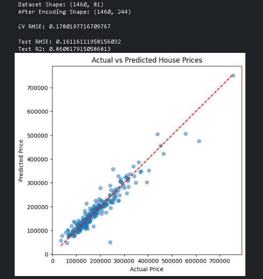
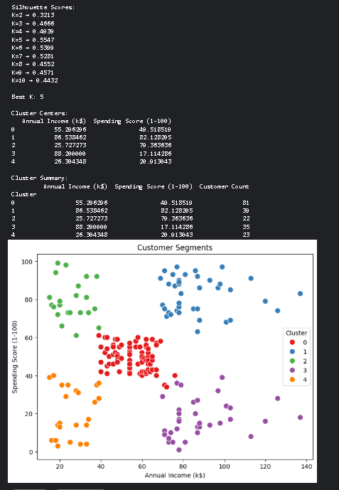
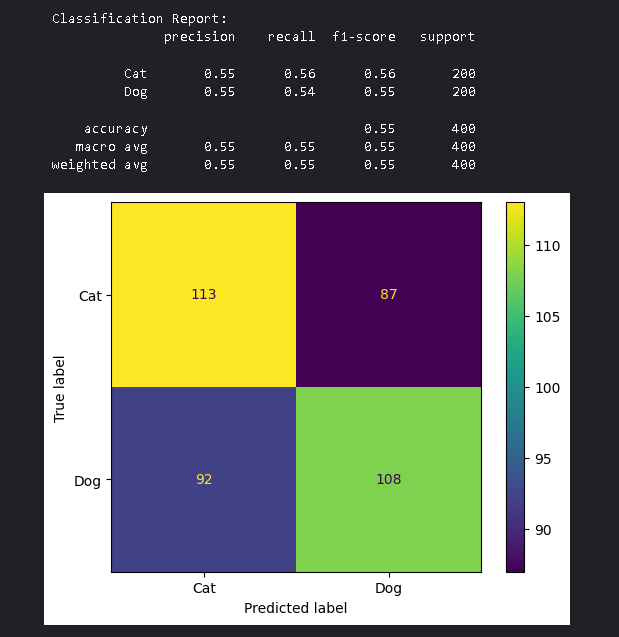
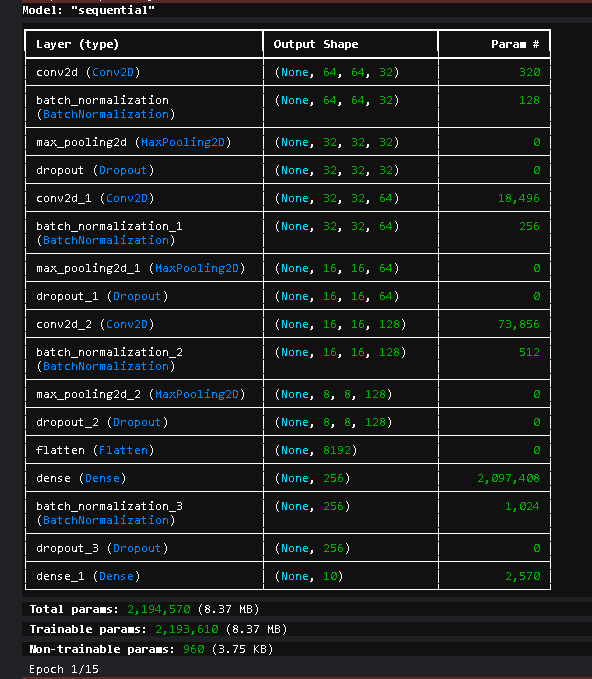
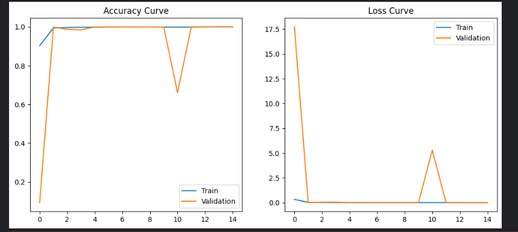
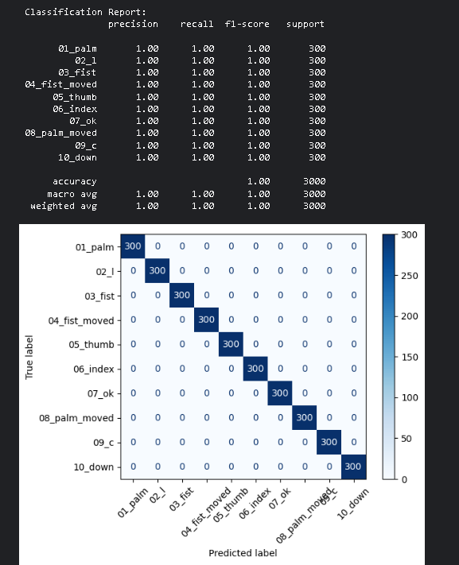
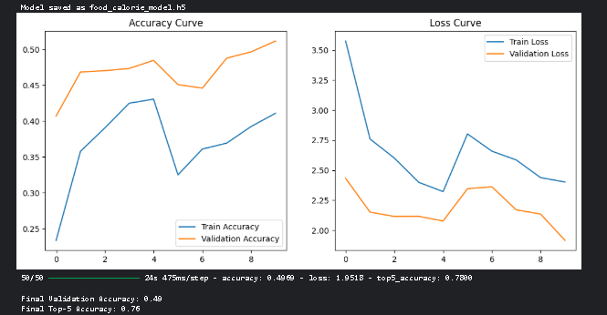

# Machine Learning Internship Projects

This repository contains the machine learning and deep learning tasks completed during my internship.  
The projects cover multiple areas of machine learning including regression, clustering, classical machine learning, and computer vision using deep learning.

---

# Projects Overview

| Task | Project | Technique |
|-----|--------|----------|
| Task 1 | House Price Prediction | Ridge Regression |
| Task 2 | Customer Segmentation | K-Means Clustering |
| Task 3 | Dogs vs Cats Classification | Support Vector Machine (SVM) |
| Task 4 | Hand Gesture Recognition | Convolutional Neural Network (CNN) |
| Task 5 | Food Image Classification | Transfer Learning (MobileNetV2) |

---

# Technologies Used

- Python
- NumPy
- Pandas
- Scikit-learn
- TensorFlow / Keras
- Matplotlib
- Seaborn
- OpenCV

---

# Task 1 – House Price Prediction

A regression model was built to predict housing prices using structured housing data.

**Model Used**

- Ridge Regression

**Result Visualization**

---

# Task 2 – Customer Segmentation

K-Means clustering was applied to group customers based on spending behavior.

**Techniques Used**

- Elbow Method
- Silhouette Score
- K-Means Clustering

**Cluster Visualization**

---

# Task 3 – Dogs vs Cats Classification

A classical machine learning model was trained to classify images of dogs and cats.

**Model Used**

- Support Vector Machine (SVM)

**Evaluation**

---

# Task 4 – Hand Gesture Recognition (CNN)

A Convolutional Neural Network was trained to recognize different hand gestures from images.

### Model Architecture

### Training Performance

### Evaluation Results

Accuracy achieved: **~100%**

---

# Task 5 – Food Image Classification (Transfer Learning)

Transfer learning was used to classify food images using a pretrained **MobileNetV2** model.

### Model Architecture

### Training Performance

Validation Accuracy: **~49%**  
Top-5 Accuracy: **~76%**

---

# Repository Structure
ML-Internship-Projects
│
├── tasks-1-3.ipynb
├── task-4.ipynb
├── task-5.ipynb
│
├── images
│ ├── house_price_prediction.png
│ ├── customer_clusters.png
│ ├── dogs_vs_cats_confusion_matrix.png
│ ├── cnn_model_architecture.png
│ ├── gesture_training_curves.png
│ ├── gesture_confusion_matrix.png
│ ├── mobilenet_architecture.png
│ └── food_training_curves.png
│
└── README.md

---

# Key Learning Outcomes

Through these projects I gained practical experience in:

- Data preprocessing and feature engineering
- Supervised learning (Regression & Classification)
- Unsupervised learning (Clustering)
- Image classification using CNNs
- Transfer learning using pretrained deep learning models
- Model evaluation and visualization

---

# Future Improvements

- Hyperparameter tuning
- Model optimization
- Deploying models using Flask / FastAPI
- Creating interactive demos for predictions

---

# Author

Abdul Baseer Hammad

Machine Learning & AI Enthusiast
